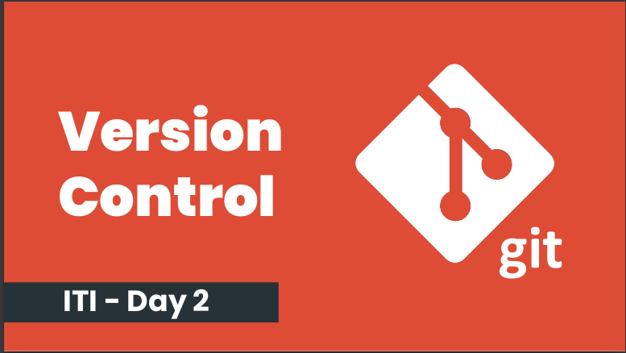

Hello To Day Two From version Control 

Tell me how to remove them locally and remotely.
--> local git push origin :branch-name 
--> remote git branch -d branch-name

Tell me how to checkout another branch without commit changes 
 --> git checkout branch-name

 Tell me how to list tags 
 --> git tag

 Tell me how to delete tag locally and remotely.
 --> remote git push origin --delete v1.7
 --> local git tag -d v1.7

